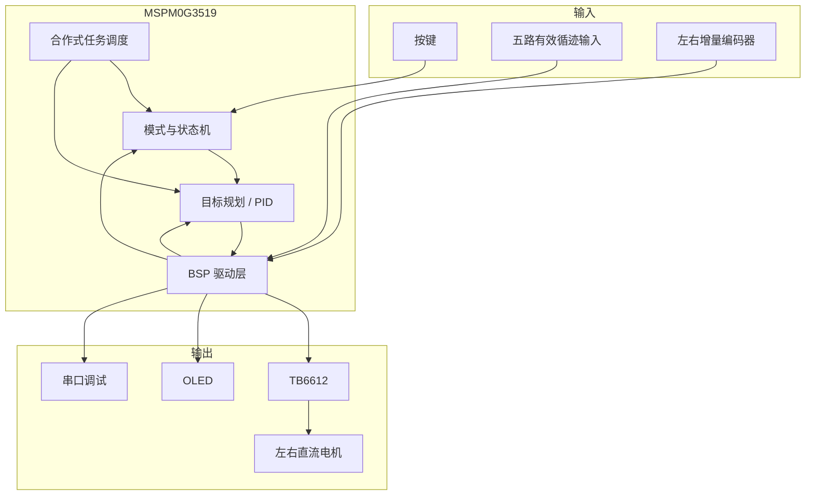
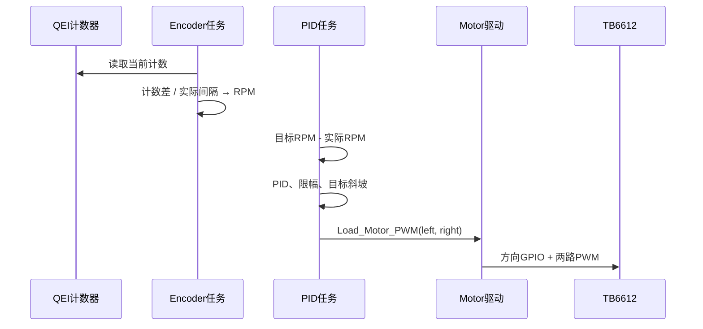

这篇文章回答一个核心问题：**一次“让小车沿线行驶”的动作，究竟经过了哪些硬件和软件模块？**

先记住一个阅读原则：构建配置回答“外设怎样配置”，调用代码回答“功能是否进入主流程”，硬件原理图回答“信号怎样连接”，上板记录才回答“实物是否按预期工作”。这四类证据不能互相替代。

本篇按“输入从哪里来—软件怎样处理—输出到哪里去”的顺序介绍系统。第一次阅读先看总图和两层分工；需要接线或调试时，再回到引脚表与任务周期。

## 一张图看懂整车



## 硬件层：信号从哪里来、到哪里去

### 主控与开发配置

当前活动目标是：

- `MSPM0G3519`；
- `LQFP-64(PM)` 封装；
- TI MSPM0 SDK `2.4.0.06`；
- SysConfig `1.21.1`；
- TI Arm Clang `4.0.3.LTS`；
- SWDIO 为 PA19，SWCLK 为 PA20。

项目中仍保留 G3507 的目标文件，这是迁移历史，不应作为当前烧录目标。

### 电源路径

扩展板提供 12 V、7 V、5 V 和 3.3 V 相关接口：

- TB6612 的 `VM` 接 12 V，逻辑 `VCC` 接 5 V；
- 系统板把 5 V 经过 LDO 转换为 3.3 V；
- 7 V 为舵机电源，与本系列的直流电机首次调试无关；
- 系统板和扩展板共享地线。

> [!WARNING]
> 原理图中的“5 V 供电”不能证明模块输出信号一定是 3.3 V。编码器、OLED、IMU 接入 MCU 前，应实测信号高电平或确认电平转换。调试器、外部 5 V 和板载降压同时连接时，还要避免多路电源互相反灌。

### TB6612 与双电机

| 功能 | MSPM0G3519 引脚 | 当前用途 |
| --- | --- | --- |
| PWMA | PB14 / TIMA0 C0 | 左电机 PWM |
| AIN1 / AIN2 | PB5 / PB10 | 左电机方向 |
| PWMB | PA7 / TIMA0 C1 | 右电机 PWM |
| BIN1 / BIN2 | PB7 / PB6 | 右电机方向 |
| STBY | PB8 | 驱动器待机控制 |

左右电机镜像安装，所以当前软件给右电机配置了 `-1` 的输出极性。上层只需要表达“车辆前进方向”，底层负责把它换算成每个物理电机的真实转向。

### 编码器

| 通道 | A 相 | B 相 | 硬件计数器 |
| --- | --- | --- | --- |
| MOTOR1 / 左轮 | PB15 | PB11 | TIMG8 / `QEI_LEFT` |
| MOTOR2 / 右轮 | PA3 | PB9 | TIMG9 / `QEI_RIGHT` |

当前 `Motor.c` 直接读取两个 QEI 定时器的 16 位计数差，并处理计数回绕。旧硬件说明中“尚未切换到硬件 QEI”的描述已经落后于当前代码。

每个电机的参数模型为：

```c
#define ENCODER1_RESOLUTION 13
#define ENCODER1_MULTIPLE 4
#define MOTOR1_REDUCTION_RATIO 28.0f
```

因此软件按 $13 \times 4 \times 28 = 1456$ 个计数/轮输出轴一圈进行速度换算。项目还根据多次 10 cm 和 35 cm 测试保存了左右轮独立的距离标定系数；这是实测标定值，不应直接复制到另一辆车。

### 循迹输入

扩展板预留 12 路循迹信号，但当前固件只读取第 4～8 路：

| 逻辑序号 | 引脚 |
| --- | --- |
| 4 | PA12 |
| 5 | PA13 |
| 6 | PA14 |
| 7 | PA15 |
| 8 | PA16 |

当前 `Tracker.c` 把低电平定义为检测到黑线、高电平定义为白色。代码仍保留 12 个位置权重，未读取的外围位置固定为“白色”，避免它们参与偏差计算。该定义来自当前代码及其测试注释；更换循迹模块后必须重新做遮挡验证。

### 当前已配置但未必启用的模块

| 模块 | 当前状态 |
| --- | --- |
| OLED | 初始化成功后加入显示任务 |
| 串口调试 | 已启用，用于输出运行数据 |
| ICM42688 | 驱动和融合代码存在，但 `ICM42688_ENABLE = 0U` |
| MPU6050 | 历史驱动保留，当前主流程不初始化 |
| 两路舵机 | PWM 已配置，默认停止，应用层未自动输出 |
| 蓝牙和串口屏 UART | 外设已配置，业务收发仍需单独核实 |

## 软件层：APP 与 BSP 分别做什么

### BSP：把硬件变成稳定接口

`BSP` 目录负责直接操作外设，主要包括：

- `Motor.c`：TB6612 方向、PWM、QEI 计数与 RPM；
- `PID.c`：左右速度环；
- `Tracker.c`：循迹 GPIO 读取与位置偏差；
- `OLED.c`：显示驱动；
- `Serial.c`：串口输出；
- `Task.c`：合作式周期调度；
- `Key_Led.c`：按键和指示输出。

BSP 的目标是隐藏寄存器和引脚细节。例如 APP 层调用 `Load_Motor_PWM(left, right)`，不需要重复处理 TB6612 的 AIN/BIN 组合。

### APP：决定小车现在应该做什么

`APP` 目录负责业务状态和控制策略：

- `Task_App.c`：初始化并登记各周期任务；
- `ModeState_App.c`：运行模式和状态切换；
- `SpeedTarget_App.c`：目标速度斜坡与停车过程；
- `PositionControl_App.c`：定距外环；
- `TrackMode_App.c`：循迹偏差、左右轮修正和阶段逻辑；
- `Display_App.c`：把关键状态组织成 OLED 页面。

这种分层的意义是：更换电机引脚时主要改 BSP；调整循迹策略时主要改 APP。把两者混在一个 `main.c` 中，会让每次调参都可能破坏底层驱动。

## 调度层：任务什么时候运行

当前主要任务如下：

| 任务 | 周期 | 作用 |
| --- | ---: | --- |
| Encoder | 10 ms | 读取两路 QEI，计算 RPM 与累计距离 |
| Tracker | 5 ms | 读取五路有效循迹输入 |
| PID | 10 ms | 目标规划、速度闭环并输出 PWM |
| Buzzer | 10 ms | 非阻塞蜂鸣提示状态机 |
| Serial | 50 ms | 调试状态输出 |
| LED | 100 ms | 运行状态指示 |
| OLED | 100 ms | 初始化成功后登记，内部还会限制刷新频率 |
| Key | 20 ms | 按键消抖和模式操作 |

这些任务共享一个主循环，属于合作式调度，不会真正并行。某个任务如果长时间阻塞，后面的编码器和 PID 也会延迟。因此：

- 不要在高频任务中加入长延时；
- OLED、串口输出必须控制频率；
- 调试时要观察真实的编码器采样间隔，而不是假定它永远等于 10 ms。

当前 `Task_Encoder()` 会用实际经过的毫秒数计算 RPM，这比把周期写死为 10 ms 更稳健。

## 一次速度闭环的数据流



这条链上的符号必须一致：车辆前进时，目标 RPM、测得 RPM 和控制器理解的方向都应为正。任何一路符号相反，PID 都可能把误差越调越大。

## 怎样判断资料是否过期

遇到冲突时，建议按以下顺序核对：

1. 当前 `.cproject` 和 `empty.syscfg`；
2. 当前实际调用的 `.c/.h`；
3. 最近的实机标定记录；
4. 硬件原理图说明；
5. README、快速手册和历史注释。

README 适合快速入门，但不能取代构建配置。源码存在也不能证明功能已启用，宏开关、初始化调用和任务登记必须同时检查。

如果“硬件说明”和“当前代码”描述不同，不应简单删除其中一方。先确认它们是否对应不同版本，再在记录中写清使用的工作副本、提交或文件日期。本工程的 QEI 描述就是一个例子：旧说明仍写着软件边沿计数，而当前 `Motor.c` 已读取 TIMG8/TIMG9 的硬件 QEI 计数器。

## 本篇总结

- 整车的输出链路由电源、MSPM0G3519、TB6612 和电机构成，编码器与循迹传感器则把运动状态和赛道信息反馈给控制程序。
- BSP 层统一管理 GPIO、PWM、编码器和传感器等硬件接口，APP 层组合任务、状态与控制策略。分层后，故障可以沿数据流逐级定位。
- 协作式调度器按不同周期运行编码器采样、速度闭环、循迹与界面任务；控制算法必须使用可信的实际采样间隔，并保证整条链路的方向符号一致。
- 资料冲突时，应依次核对活动构建配置、SysConfig、实际调用代码和实机记录。README 与历史注释适合辅助理解，但不能代替当前配置。

**上一篇：**[01｜认识实验室 TI_CAR](../01-ti-car-start/)　
**下一篇：**[03｜第一次让电机安全转起来](../03-first-motor-run/)
