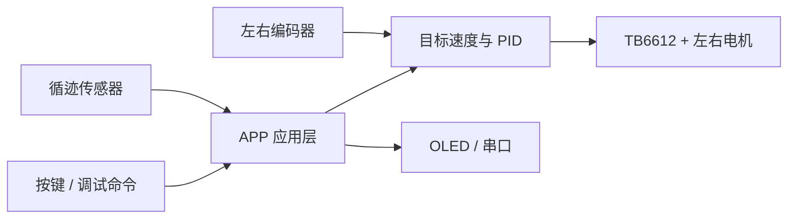

如果你刚进入小车组，看到工程里的 `APP`、`BSP`、PID、PWM、编码器、循迹和一大堆引脚，很容易不知道从哪里下手。

这套教程不会要求你先把整个工程背下来。我们的目标是按一条可验证的路线，逐步做到：**看懂系统、让单个电机安全转动、读到编码器、闭环控制速度，最后再进入循迹和整车任务。**

> [!IMPORTANT]
> 本系列以实验室当前的 `TI_CAR_test1_6.7` 工程、SysConfig 配置和硬件说明为依据。旧 README 中仍有 `MSPM0G3507`、四轮控制和八路循迹等历史描述，它们不能代表当前实现。

## 先认识我们手里的小车

当前工程的关键事实如下：

| 项目 | 当前实现 |
| --- | --- |
| 主控 | TI MSPM0G3519，LQFP-64，Arm Cortex-M0+ |
| 开发方式 | Code Composer Studio、TI Arm Clang、SysConfig |
| 电机驱动 | TB6612 双路直流电机驱动 |
| 执行机构 | 左、右两路带编码器直流减速电机 |
| 速度输出 | TIMA0 两路 PWM，软件指令范围 `-1000` 到 `1000` |
| 速度反馈 | TIMG8/TIMG9 硬件 QEI 计数，定期换算为 RPM |
| 循迹 | 逻辑上保留 12 路位置，当前实际读取第 4～8 路共 5 个传感器 |
| 显示与通信 | OLED、UART 调试及预留的蓝牙/串口屏接口 |
| 姿态传感器 | ICM42688 驱动已保留，但当前配置默认关闭 |
| 调度方式 | `while (1)` 中运行的合作式周期任务调度器，不是 RTOS |

这是一辆典型的差速小车：左右轮同向且速度接近时直行；两侧速度不同会转弯；两侧反向则可以原地旋转。



## 代码是怎样跑起来的

程序入口很短：

```c
int main(void)
{
    SYSCFG_DL_init();
    Task_Init();

    while (1)
    {
        Task_Start(Sys_GetTick);
    }
}
```

这三步分别表示：

1. `SYSCFG_DL_init()` 根据 `empty.syscfg` 生成的配置初始化时钟、GPIO、定时器、I2C、UART 等外设。
2. `Task_Init()` 初始化电机、串口、OLED、PID 和中断，并登记各个周期任务。
3. 主循环不断调用 `Task_Start()`，调度器检查哪些任务已经到期，然后依次运行它们。

因此，看懂这个工程时不要从 `main.c` 一路向下硬读。更有效的方法是沿着一条实际数据链追踪：

```text
编码器计数 → Task_Encoder → Encoder_Actual_Val
             ↓
目标转速 → Task_PID → SpeedPID_Update → PWM
             ↓
       Motor_SetDuty → TB6612 → 电机
```

## 推荐学习顺序

### 阶段 0：先学会安全停机

在研究“怎么让车跑”以前，先知道怎样让它停：

- `Load_Motor_PWM(0.0f, 0.0f)` 把两路 PWM 清零；
- `set_motor_disable()` 先清零 PWM，再把 TB6612 的 `STBY` 拉低；
- 调试时让车轮离地，并确保能立即断开电机电源。

如果还不知道断电开关在哪里，就不应该进行带轮落地测试。

### 阶段 1：最小输出

目标是只让一个轮子低占空比、短时间转动，并确认：

- 左右电机接口没有接反；
- 正负指令对应的机械方向符合预期；
- 停止后 `STBY` 确实为低；
- MCU 没有因为电机启动而复位。

### 阶段 2：编码器反馈

先手动转动车轮，再观察计数方向；之后才让电机带动编码器。当前工程按以下模型计算轮速：

$$
n = \frac{\Delta C \times 60000}{N \times \Delta t}
$$

其中 $\Delta C$ 是采样周期内的计数变化，$N$ 是配置的一圈计数，$\Delta t$ 的单位是毫秒，结果 $n$ 的单位是 RPM。

### 阶段 3：速度闭环

闭环不是“加一个 PID 函数”这么简单。需要先确认：

- 正向转动产生正速度反馈；
- 实际采样周期可信；
- PWM、速度目标和反馈单位一致；
- 输出有限幅，积分不会无限累积；
- 停车逻辑优先于调速逻辑。

### 阶段 4：循迹

当前板上实际使用第 4～8 路五个循迹输入。传感器检测到黑线时为低电平，软件将各传感器位置加权得到横向偏差，再用这个偏差修正左右目标速度。

### 阶段 5：整车任务

最后再研究直线定距、两套循迹参数、减速停车、蜂鸣提示、OLED 页面和串口调参。这样遇到问题时，你能定位是硬件输入、底层驱动、控制器还是任务状态机出了错。

## 新生最容易踩的四个坑

### 1. 把文件名当作真实配置

工程里保留了 G3507 的目标文件和旧说明，但活动构建配置明确指向 `MSPM0G3519`。判断主控时，应优先查看 `.cproject`、`empty.syscfg` 和当前目标配置，而不是只看目录名或旧 README。

### 2. 把 PWM 指令当成百分数

当前 `Motor_SetDuty()` 接收的范围是 `-1000` 到 `1000`。例如 `100` 是约十分之一量程，不是 100%。负号用于改变方向。

### 3. 一上来就落地跑整车

如果左右电机或编码器有一路极性错误，落地测试会让问题迅速扩大。正确顺序是：断开负载检查供电，再架空单轮测试，最后才双轮落地。

### 4. 看到源码存在就认为功能已启用

ICM42688、MPU6050、舵机和多个 UART 都能在目录中找到代码或配置，但“存在”不等于“当前主流程正在使用”。例如 `ICM42688_ENABLE` 当前为 `0U`。

## 读完后应该能回答

1. 当前主控为什么应称为 MSPM0G3519，而不是 G3507？
2. 目标速度、编码器反馈和 PWM 分别在哪一层产生？
3. 为什么第一次实验必须先验证停机路径？
4. 当前循迹数组有 12 个位置，为什么实际只读取 5 路？

下一篇将拆开整套软硬件架构，并给出当前有效的电机、编码器、循迹、显示和通信映射。

**下一篇：**[02｜TI_CAR 软硬件架构全景](../02-system-architecture/)
