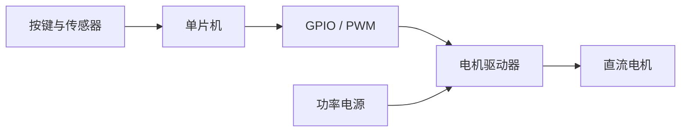

单片机不能靠一根 GPIO 直接带动电机。它负责产生控制信号，电机驱动器负责放大功率，电源负责提供能量，电机再把电能变成机械运动。

理解这条链路后，你会发现“电机不转”并不是一个问题，而是主控配置、控制信号、驱动状态、功率供电和机械负载等多类问题的共同现象。

## 本篇目标

本篇建立从程序到机械运动的最小模型。重点不是背寄存器，而是能沿着“主控—GPIO/PWM—驱动器—电机”逐段检查，并理解为什么看到 PWM 仍不能证明电机一定会转。

## 单片机在小车里做什么

单片机可以理解为一个擅长实时控制的小型计算机。它按照程序读取输入、执行计算，再更新输出。



单片机输出的是命令，不是电机所需的全部能量。把电机直接接到 GPIO，可能超过引脚允许的电流并损坏芯片。

## GPIO：最基本的数字输入输出

GPIO 是通用输入输出引脚。作为数字输出时，它通常表达低电平或高电平；作为数字输入时，它读取外部电路当前被判断为低还是高。

输出高低电平不等于输出任意电压。具体电平范围、最大电流和上电默认状态都要查对应芯片的数据手册。

在电机控制中，GPIO 常用于：

- 设置旋转方向；
- 控制驱动器的使能或待机；
- 读取故障状态；
- 控制 LED 和蜂鸣器等简单外设。

## PWM：快速开关形成平均效果

PWM 是脉宽调制。它在固定周期内快速切换高低电平，通过改变高电平所占比例来改变平均作用效果。

高电平持续时间占整个周期的比例叫占空比。例如，占空比 20% 表示每个周期约有五分之一的时间为高电平。

```text
20%  ┌─┐    ┌─┐    ┌─┐
     ┘ └────┘ └────┘ └────

70%  ┌──────┐  ┌──────┐
     ┘      └──┘      └──
```

占空比通常影响电机获得的平均电压和转矩，但它不等于真实转速。负载、电源、电机差异、摩擦和电池电量都会改变最终结果。

PWM 还有频率。频率过低可能导致明显抖动或噪声，过高则可能增加驱动损耗。实际范围应根据驱动器和系统要求确定，不能套用固定数值。

## 电机驱动器：为什么需要功率级

电机启动电流通常远大于单片机引脚能够提供的电流。驱动器接收单片机的小功率控制信号，再控制功率电源向电机供能。

常见的双向直流电机驱动器使用 H 桥。你暂时不必记住内部每个晶体管，只需理解三类控制：

- **方向信号**：决定电机两端电压的极性；
- **PWM 信号**：调节输出的平均作用强度；
- **使能或待机信号**：决定功率输出是否允许工作。

不同驱动器对信号组合的定义不同。某个组合可能表示正转、反转、滑行或制动，必须以芯片数据手册和板卡原理图为准。

## 开环控制是什么

只给出一个 PWM 指令，却不测量实际速度，叫开环控制。它简单、适合完成第一次输出验证，但无法自动补偿坡度、负载和电池电压变化。

```text
期望输出 → PWM → 驱动器 → 电机
```

加入编码器后，系统可以测量实际速度，将它与目标速度比较，再修正 PWM。这才形成速度闭环。

```text
目标速度 → 控制器 → PWM → 电机 → 实际速度
              ↑                 │
              └──── 编码器反馈 ──┘
```

因此，第一次让电机转起来只是在验证输出链路，还不能说明小车已经具备稳定的速度控制能力。

## 通用的首次输出流程

下面是逻辑顺序，不是可直接复制到某款芯片的 API。真实函数名和引脚必须依据当前工程配置填写。

```c
// 伪代码：名称仅表达控制意图
motor_output_disable();
set_motor_direction(FORWARD);
set_motor_pwm(LOW_OUTPUT);
motor_output_enable();

wait_a_short_time();

set_motor_pwm(0);
motor_output_disable();
```

执行前应完成这些准备：

1. 架空车轮，清理周围导线和工具。
2. 核对功率电源、逻辑电源、GND 和信号电平。
3. 确认 PWM 的实际输入范围，不把任意数值当成百分比。
4. 先验证停机路径，再执行低输出、短时间测试。
5. 记录方向、声音、电源电流和是否出现复位。

## 看到现象后怎样继续判断

排查时从最靠近已知正确的一端开始，不要同时改代码、接线和供电。每确认一段，就留下波形、读数或日志，再进入下一段。

### 电机完全不动

先确认驱动器是否使能、功率电源是否到达驱动板、方向信号是否有效，以及 PWM 是否真的从目标引脚输出。

### 电机只有声音但不转

可能是输出过低、机械阻力过大、供电限流或驱动状态不正确。不要立即把输出调到最大，应逐项测量。

### 电机一动主控就复位

优先检查电源压降、地线、启动电流和电机干扰。此时不断修改控制算法通常没有帮助。

### 转向与程序命令相反

先记录现象，再检查电机接线和软件方向定义。不要为了“看起来正确”同时交换接线并修改代码，否则无法知道真正原因。

| 已确认的证据 | 下一段要查什么 |
| --- | --- |
| 程序在运行，GPIO 状态正确 | PWM 是否从目标引脚输出 |
| PWM 波形正确 | 驱动器使能、方向组合和逻辑电源 |
| 驱动输出正确 | 电机功率电源、接插件和机械负载 |
| 电机能够转动 | 编码器反馈与闭环控制 |

## 本篇总结

- 单片机负责产生控制信号，电机驱动器负责控制功率电源向电机供能，因此 GPIO 不能直接驱动电机。
- GPIO 常用于方向和使能控制；PWM 通过占空比调节平均作用强度，但占空比不等于电机的真实转速。
- 只输出 PWM 而不测量速度属于开环控制。加入编码器反馈，并根据目标与实际速度的误差修正输出后，才形成速度闭环。
- 第一次输出实验应遵循“先验证停机、再低输出短时运行、最后再次停机”的顺序，并记录电流、方向、声音和复位现象。

完成这三篇后，再进入具体车型会更顺畅。实验室 TI 小车的芯片、引脚、驱动器和代码入口统一放在“TI 小车实战”目录，不与通用入门概念混在一起。

**上一篇：**[02｜零基础电学](../02-electrical-basics/)　
**下一阶段：**[认识实验室 TI_CAR](../../ti小车实战/01-ti-car-start/)
